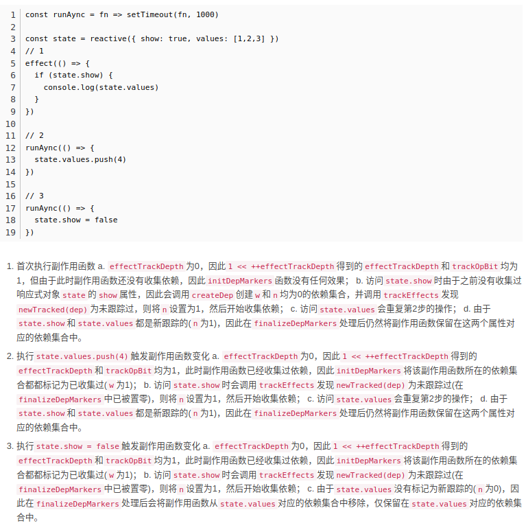

# vue3知识点总结
## reactive 响应式系统
`vue3` 的响应式系统是基于订阅发布者模式，通过 `proxy` 实现对数据的响应式化，    
而依赖副作用的收集就是根据响应式化的数据来进行的。  
因为 `Proxy` 本质上是对某个对象的劫持，这样它不仅仅可以监听对象某个属性值的变化，还可以监听对象属性的新增和删除；
而 `Object.defineProperty` 是给对象的某个已存在的属性添加对应的 `getter` 和 `setter`，所以它只能监听这个属性值的变化，而不能去监听对象属性的新增和删除。

<h4 style='color:red'>注意</h4>
这里需要明确的一点，`reactive` 只是做了数据的响应式化处理，使用 `proxy` 代理数据对象，并在 `get`、`set` 中完成了数据访问劫持和数据设置触发依赖。  
`get` 和 `set` 是在有访问或设置操作进行是才会触发的，
而 `vue` 的依赖收集（track）实际上是要结合 `effect Api` 进行的。  
例如:

```javascript
let foo = reactive('foo')
let consoleFoo = ()=>{
    console.log(foo)
}
effect(consoleFoo)
```

在上述代码中，首先通过 `reactive` 对 `foo` 做了代理，而 `consoleFoo` 方法则访问了 `foo` 并打印，  
然后在 `effect` 中传入的函数 `consoleFoo`，在这个过程中，`effect` 会运行一遍传入的函数 `consoleFoo`，  
此时 `consoleFoo` 会被当做当前激活依赖存放在全局变量 `activeEffect` 上，而 `consoleFoo` 运行时访问了 `foo`，此时会触发 `get`，从而将当前的  
`activeEffect`（也就是 `consoleFoo`），当做 `foo` 的依赖进行收集。
### reactive 的基本实现
`reactive API` 的实现其实就是创建并返回了一个 `proxy` 对象，    
将原始数据对象 `raw` 和 `mutableHandlers` 传递给 `proxy` 构造函数，    
完成对象的响应式代理。  
其中 `mutableHandlers` 位于 `baseHandlers.ts` 中，其具体实现中  
`Getter` 实现数据访问劫持:  
`Getter` 接受两个参数 `isReadonly = false`,`isShallow = false`，用于标记是否创建的是 `readonly` 或 `shallow`  
并且 返回了一个 `get` 方法，在 `get` 方法内部
* 首先判断访问的 `key` 是否是 `__v_reactive` 或 `__v_readonly`，并返回（`isReadonly` 和 `isReactive` 实现），
* 然后根据 `Getter` 接受两个参数判断 `isReadonly = false`，则调用 `track` 做依赖收集。
* 判断 `isShallow = true`，直接返回访问目标值 `res`
* 如果访问目标值 `res`是对象，则根据 `isReadonly` 判断递归调用 `readonly Api` 或 `reactive Api` 并传入 `res`  

`setter` 实现数据设置派发更新:  
将访问的目标对象 `target`、设置的 `key`，设置的值传递 `trigger` 方法 派发啊更新  
### effect的基本实现（runner、scheduler、stop）以及依赖收集与触发依赖
#### effect 主流程
`effect` 接受参数 `effect` 接受依赖函数 `fn` 和配置对象（内含调度执行函数 `scheduler` 和 `onStop方法`），  
* 方法内部会通过 `ReactiveEffect` 创建 `_effect` 对象（`_effect` 接受依赖函数fn，和调度执行函数 `scheduler` ），  
* 然后会将 `onStop` 通过 `Object.assign` 拷贝到 `_effect`   
* 执行 `_effect.run` (其实这里就是执行了 依赖函数 `fn`，因为创建 `_effect` 时已经传递进去了)，此时如果 `fn `内部访问了 响应式对象，fn则会当做依赖被收集到对应 响应式对象依赖中。  
* 创建 `runner` `_effect.run.bind(_effect)`）,并把 `_effect` 存在 `runner` 上（实现 `stop` 方法）  
* 返回 `runner`（`_effect.run.bind(_effect)`），用户可以手动通过 `runner` 触发依赖，  
#### ReactiveEffect 对象
```javascript
_fn // 依赖函数
deps = [] // 依赖函数集合
active = true // 是否激活,stop方法执行后用于判断
onStop = ()=>{} // stop 钩子方法
```
首先依赖收集有全局变量 `activeEffect`（当前激活的 `effec` t对象，内含副作用依赖），`shouldTrack`（是否需要收集）  
`ReactiveEffect` 对象还包含一个 `run` 方法 和 `stop` 方法,    
在构造方法时，`_fn` 会缓存当前传入的依赖函数 `fn`，
当外部调用 `run` 方法时，`run` 方法内部会先判断  `active === false`,    
命中则直接返回 依赖函数执行结果 `this._fn()`；    
否则 `shouldTrack` 设置为 `true`  
就把 `activeEffect` 指向当前 `ReactiveEffect` 对象（用于 `track` 时收集），  
执行结果 `res = this._fn()；`  
`shouldTrack` 设置为 `false`
最后返回 `res`
注意，实际上 `activeEffect` 指向当前 `ReactiveEffect` 对象这一步是通过effectStack 栈 维护的
````javascript
const counter = reactive({
num: 0,
num2: 0
})
function logCount() {
effect(logCount2)
console.log('num:', counter.num)
}
function count() {
counter.num++
}
function logCount2() {
console.log('num2:', counter.num2)
}
effect(logCount)
count()
````
上述代码中，如果单纯的把`activeEffect` 指向当前 `ReactiveEffect` 对象，`effect(logCount2)`   
执行完后 activeEffect 指向的是 `logCount2`,而后续的 `console.log('num:', counter.num)` ,  
会导致错误的将 `logCount2`作为 `num`的依赖收集，  
此时我们`count()`,触发的依赖却是 `logCount2`，在 `fn` 执行完毕后出栈，再把 `activeEffect` 指向 `effectStack` 最后一个元素，  
也就是外层 `effect` 函数对应的 `reactiveEffect`  


当外部调用 `stop` 方法时，`stop` 方法内部会先判断  `active === true`,  
然后判断是否传入了 `onStop` 钩子函数，有就运行 `onStop`。然后清除依赖，并把 `active = false`,  
<h4 style='color:red'>注意</h4>
`stop` 方法想要实现的效果其实是 `stop` 后，清空收集的依赖并不在收集、不执行副作用函数，需要手动调用 `runner`，  
这个效果实际上是通过 `shouldTrack` 和 `this.active` 实现的    
正常情况下 `run` 方法运行，`shouldTrack` 设置为 `true` ，然后执行 `this._fn()`，在这个 `this._fn()` 过程中会触发 `track` 做依赖收集，    
而 `track` 会判断 `shouldTrack`，为 `false` 直接返回不收集，
正常流程 `shouldTrack = true =》this._fn() =》 track 收集 =》shouldTrack = false`，
注意此流程走完后依赖收集完毕是 `false` 的， 而在调用 `stop` 方法后因为 `this.active` 变为 `false`，`run` 方法运行他会直接返回 `this._fn()` 的结果，不会在设置
`shouldTrack = true`，于是在 `track` 时会被直接返回捕收剂。
#### 为什么effect.run 每次运行都要清空effect对象上的依赖？
见 `why should cleanupEffect in ReactiveEffect`
#### stop方法Api
`stop`方法`Api`，传入一个 `runner`，当 `trigger` 后 ，不执行副作用函数，需要手动调用 `runner`，
其内部就是通过传入的 `runner` 访问都 `effect` 对象，并调用 `effect` 对象上的 `stop` 方法

#### track
先判断 `shouldTrack`，为 `false` 直接返回不收集
全局维护了一个 `targetMap`，`key` 是响应式原始对象 `target`，值是 `depsMap`。
`depsMap`的 `key` 是 `target` 中的各个 `key`，值是一个 `deps`（本质是 `Set` ），  
`deps` 中每个元素是都对应这这个 `key` 的一个 `activeEffect`（ `ReactiveEffect` 对象，依赖函数 `fn` 实际上就存储在 `ReactiveEffect` 的 `_fn`上）
`track` 方法主要是对上述数据结构的一些维护，比如没有就创建，有就获取，最终创建或找到对应 `target` 的对应 `key` 的依赖集合 `deps`，然后调用 `trackEffects` 把 `activeEffect` 收集到 `deps` 中，
值得注意的时 `trackEffects` 还反向收集 `activeEffect.deps.push(dep)`，在清除依赖时使用
#### trigger
从 `depsMap` 中找到对应 `target` 对应 `key` 的 `deps`，并传递给 `triggerEffects` 调用
`triggerEffects` 循环遍历 `dep` 拿到每个 `effect` 对象 调用 `run` 或 `scheduler`
#### scheduler 的调度执行
`scheduler` 的调度执行，通常会在一些调度优化、计算属性 `compute` 中会使用到，其表现出来的效果是
1.`effect` 支持传入一个包含名为 `scheduler` 函数的 `options`
2.`effect` 首次执行时，传入给 `effect` 的`fn`（即依赖）执行
3.当对应响应式对象 `set` 并 `trigger` 时，不执行 `fn`（即依赖） 而执行 `options` 的 `scheduler` 函数
4.当执行 `runner` 时（`effect` 的返回） 能够执行 `fn`（即依赖）

其实现就是在 `trigger` 时  `triggerEffects` 变量依赖集合 `dep` 并调用里面依赖对象时，判断依赖对象 `effect` 是否
有 `scheduler` 有就执行否则就执行run来执行依赖函数 `fn`
<h4 style='color:red'>注意</h4>
`scheduler` 调度执行只是没有执行 `fn` 而是执行了 `scheduler`，但是响应式数据对象的值是改变了的

### readonly 的基本实现
与 `reactive` 相似，只是创建 `proxy` 时传入的 `Getter` 的 `isReadonly` 为 `true`
这使得在触发 `get` 做依赖收集时，不再执行 `track` ，
`set` 直接返回 `true`，不修改值，实现 只读 与 不收集依赖。
### shallowReadonly 的基本实现
与 `reactive` 相似，只是创建 `proxy` 时传入的 `Getter` 的 `isReadonly` 为 `true`，`isShallow` 为 `true`  
这使得在触发 `get` 做依赖收集时，不再执行 `track` ，然后先判断 `isShallow` 命中 直接返回，不做递归执行 `reactive` 或 `readonly`  
### isReadonly 的基本实现
接受一个 `target` 作为参数，访问 `target` 上的 `__v_readonly` 属性，这会触发 `get` 
在 `get` 中 判断是否访问的 key 是 `__v_readonly`，命中 则返回 `isReadonly`（`readonly(obj)` 时，传入给 `Getter` 为 `true`）
### isReactive 的基本实现 
接受一个 `target` 作为参数，访问 `target` 上的 `__v_reactive` 属性，这会触发 `get`
在 `get` 中 判断是否访问的 key 是 `__v_reactive`，命中 则返回 `!isReadonly`（`readonly(obj)` 时，传入给 `Getter` 为 `true`）
### isProxy 的基本实现
接受一个 `target` 作为参数，返回 `isReactive(target) || isReadonly(target)`
### ref 的基本实现
ref 的出现与设计 是因为 reactive 是基于 proxy 实现 get 、set 来实现数据的访问劫持与设置派发更新，这是针对对象而言的，而对于基本数据对象类型
String、Boolean、Number等，则需要对包装一层对象，再通过 proxy 来实现数据的访问劫持与设置派发更新。
ref 实际上是 创建并返回了一个 refImpl 对象
#### refImpl
```javascript
_value // 当前值
_rawValue // 原始值
dep = new Set() // 依赖集合 
__v_isRef = true // 是否是 ref 对象标识
```
构造函数运行时，会先判断传入是否为对象，是则先用 `reactive` 处理一遍，然后把他们存在 `_value` 上，`_rawValue` 存储一开始的 `_value`，  
`refImpl` 的 `get` 方法 实现数据劫持，直接调用 `trackEffects` 依赖收集  
`refImpl` 的 `set` 方法 实现数据设置派发更新，判断根据 `_rawValue` 数据是否变化，   
判断新值是否为对象，是则先用 `reactive` 处理一遍，  
然后把他们存在 `_value` 上，`_rawValue` 存储一开始的 `_value`，  
`triggerEffects` 派发更新
### proxyRefs 的基本实现，实现ref的访问代理
`proxyRefs` 能够代理 一个对象中的 `ref` 对象，在 `template` 模板中会用到
1.`proxyRefs` 方法返回一个对象，该对象不需要`.value`即可访问 `ref` 对象值
2.通过对 `proxyRefs` 方法返回对象进行修改，能够映射到对应 `ref` 对象上进行修改
其本质是返回一个 代理 `ref` 的 `proxy` 代理对象
在 `get` 中 判断访问的 `target` 是否是 `ref`，是这返回 `res.value`，否则返回 `res`
在 `set` 中 判断访问的 `target` 是否是 `ref` 且 新值不是 `ref`，则直接 `targetVal.value = 新值`，否则直接 `targetVal = 新值`
### compute计算属性的基本实现
1.`computed` 接受一个方法 `fn` ，该方法内部应该具有访问响应式对象的语句
2.`computed` 返回一个通过 `.value`访问的对象，`.value`会触发 `computed` 接受方法 `fn`，并拿到返回值
3.`computed` 具有惰性，多次访问 `.value`，在对应响应式对象值不改变的时候，不会多次触发接受的方法
4.`computed` 在对应响应式对象值改变的时候，访问 `.value`,才触发接受的方法 `fn`
其本质是对effect方法的封装，并利用了effect的lazy和scheduler配置，它内部创建了一个 `computedRefsImpl` 对象，把 `fn` 传递给构造函数
在构造时，会把 `fn` 通过 `ReactiveEffect` 创建一个 `effect` 对象 放在 `this.effect` 中，并传入调度执行方法 `scheduler`。
在 `scheduler` 方法内部会修改 `computedRefsImpl` 对象 上的属性 `this._isDirty = true`，这样响应式值改变时不会触发更新，而在 `.value` 访问时  
又可以获取到新的值
在 `get` 方法内部 `this._isDirty = true`，则重置 `this._isDirty = false`，并调用 `this.effect.run()` 触发更新，返回更新后的值
<h4 style='color:red'>注意</h4>
`computed` 返回的值，在 `.value` 访问时，由于没有进行 `set` 操作，故 `_isDirty = false`，不会在 `get` 中执行 `this._effect.run()`，
而由于是调度执行，在给 `fn` 里的响应式对象赋值后，会触发 `scheduler`，`_isDirty = true`，在在 `.value` 访问时get中执行 `this._effect.run()`
从而实现惰性，
此外这里是 直接调用 `ReactiveEffect` 而不是 `effect Api`，所以 `fn` 不会先执行一次
### watch 监听属性的基本实现
watch 是用来监听响应式对象的。  
watch 与 watchEffect 都是通过调用doWatch 来实现的  
其实他们本质还是基于对effect方法的封装，并利用了effect的lazy和scheduler配置，  
在doWatch方法中，会根据传递进来的第一个参数，也就是监听目标，根据它的类型去封装成一个getter函数 做不同的处理，例如是ref，则getter = (s)=>s.value，  
是数组则getter内部会遍历这个数组，是reactive，则会递归的方位每一个键等等，这个封装的getter是为了能够拿到监听目标的最新值并返回，  
所以会作为effect的第一个参数传递个effect，如此则实现了对监听目标的监听；然后设置了  
effect 为lazy配置为true，防止effect会运行一次getter；而在watch内部还封装了一个方法 job，这个job方法会作为effect的scheduler方法传递给effect，  
在watch 内维护着 nVal 和 oVal，在job内部会通过执行effect的返回值effectFn，拿到新值，并调用用户传递的cb，将新值和旧值传递给用户（最后会更新旧值），这样就实现了监听目标改变，能够相应的运行  
用户传递个cb，并拿到新旧值功能。  
关于配置项 immediate，如果传了，watch内部会立即执行一次job。
关于onInvalidate，watch内部有一个 onInvalidate 方法，会在job执行是作为第三个参数传递给用户，而用户传递给onInvalidate的cb会放在全局变量cleanup上，每次执行job  
前都会判断执行一次cleanup，这个属性可以用于异步场景中监听目标多次改变引发的过期处理。  
<hr>  

## vue3.2中 对依赖收集与清空的优化  
在vue3.2以前，effect每次run都会对对应的effect对象的deps中依赖进行清除，  
这个过程涉及大量的set，delete等操作，而在实际使用场景中依赖关系是很少改变的，  
因此这里存在一定的优化空间。  
1.首先设置了一个`effect`最大递归层数30,与当前`effect`递归层数 `effectTrackDepth`  
当 `effectTrackDepth` 达到30,每次run才对对应的对应的effect对象的deps中依赖进行清除。  
并在track时做全依赖收集。  
2.当递归层数小于30时，在依赖收集的数据结构中，dep原先是一个set，  
现在增加了一个w属性（dep依赖最先被搜集层数），  
wasTracked的缩写，采用二进制格式，每一位表示不同effect嵌套层级中，该依赖是否已被跟踪过(即在上一轮副作用函数执行时已经被访问过)  
一个n属性用于标识依赖最新出现的层数，  
newTracked的缩写，采用二进制格式，每一位表示不同effect嵌套层级中，该依赖是否为新增(即在本轮副作用函数执行中被访问过)  
在trigger触发effect的run时，会将deps上的w属性设置为当前层数，  
而再次 track 时，有一个shouldTrack变量初始为false，它为true时才真正把activeEffect放入deps  
然后判断deps的n属性（初始为0,初始比进标记逻辑），若 `n` 层数与当前层数 `trackOpBit`  
位运算为0,则用 `trackOpBit` 更新n属性，这样在嵌套场景中，若某个依赖在多个层级出现，则能够更新n属性，  
若在同层出现，则表示已经在同层收集过，不在进行收集，更新n属性后，会根基w属性与当前层数 `trackOpBit`  
来判断是否需要收集。  
n与w属性的设计使得在某些嵌套场景中，依赖重复收集的问题得到优化，结合最大递归数，使得减少了依赖清除操作，使得  
性能得到提升。  
而最后effect的run方法还有一个finaly，在其中调用了`finalizeDepMarkers`方法，对曾经标记收集过的依赖，  
而本次副作用没有进行标记跟踪的依赖进行删除。  




## runtime-core 运行时核心-初始化
createRenderer 方法创建渲染器对象，他是可拔插设计，接受支持传入参数包括创建节点方法、节点传入方法、节点移动方法、节点删除方法等，
这种可拔插设计使得具体渲染流程与具体的元素操作逻辑解耦，实现不同平台渲染器的支持。
createApp 方法实际上内部返回的就是 createRenderer方法创建渲染器对象的createApp属性的调用运行结果，这个属性的值是createAppApi方法的返回值，
createAppApi实际上是一个闭包，他接受一个渲染参数render（这个参数是定义在createRenderer中的，上下文关系createAppApi调用时是在createRenderer的返回值中）
createAppApi返回的函数中接受参数为rootComponent 即入口根组件，createAppApi返回的函数中的返回值则是包含mount方法的对象，这样我们就可以调用mount方法进行挂载了
mount方法接受根节点，可以是dom选择器字符串，也可以是dom节点。
mount 方法内部会根据 ，根据根组件 rootComponent ，创建vnode，并把rootContainer、vnode传递给render方法
render方法，就开始了正式的初始化流程。
### component组件的基本初始化流程
在render方法内部实际上会调用patch方法来处理，patch方法来会根据vnode的type以及patchFlag进行判断然后走不同的分支逻辑，
例如Type是文本就会走processText，是Fragment就会走processFragment，
组件则会走 
processComponent -> n1为 undefined -> mountComponent （
创建组件实例 createComponentInstance
处理setup  setupComponent -> initProps -> initSlots -> setStatefulComponent->handleSetupResult->finishComponentSetup
调用处理render具体渲染 setupRenderEffect
）
setStatefulComponent:创建组件代理使得render方法内能够通过this访问组件实例,如this.$el等、在setup调用前创建currentInstance、调用setup拿到setupResult
handleSetupResult:根据setupResult结果做处理，setupResult是对象则挂载 instance.setupState上，这里用proxyRefs做了ref的解包
是方法则作为渲染方法挂载 instance.render上。
finishComponentSetup：处理render，渲染方法挂载 instance.render上。
render来源 
1.setup返回render，优先级最高，在handleSetupResult中先挂到instance.render上
2.组件内option的render，优先级第二 在finishComponentSetup中挂到instance.render上
2.template编译生成的render，优先级最低 在finishComponentSetup中，当有编译结果compiler && !组件内option的render && !instance.render
compiler才挂到instance.render上
setupRenderEffect：
主要是逻辑调用组件实例上的渲染方法 instance.render 拿到子树虚拟节点，并递归的调用patch递归处理子节点，并把组件实例上instance.isMounted设置为true，
下次组件就根据isMounted 走更新逻辑。
这些逻辑是放在effect中调度执行的，这样就实现了视图个更新对比，effect的返回值会存储在instance.update上，当组件或元素更新时，在effect调度执行
scheduler，把instance.update放入微任务队列中执行，实现视图更新patch。

### 普通dom的Element元素基本初始化流程
在render方法内部实际上会调用patch方法来处理，patch方法来会根据vnode的type以及patchFlag进行判断然后走不同的分支逻辑，
例如Type是文本就会走processText，是Fragment就会走processFragment，
dom元素则会走
processElement -> n1为 undefined -> mountElement（
调用传入给 createRenderer 的 createElement 根据vnode创建真实节点 el；
根据 children 和 patchFlag分别处理，children是文本就直接给el，是数组则遍历递归走patch；
遍历vnode的props，调用传入给 createRenderer 的 patchProp 给el添加属性或添加事件；
(beforeMounted)
调用传入给 createRenderer 的 insert将el插入都真实节点容器中
(onMounted)
）
### 组件代理对象的基本实现
在render函数运行时，能够通过this，访问到组件实例
原理是在组件初始流程时，setStatefulComponent中创建了组件代理对象，并存储都instance.proxy上
在setupRenderEffect时，调用instance.render 获取subTree时，通过call将instance.proxy作为render运行时
的this实现。
组件代理对象的handler实现就是根据访问的key做判断，返回组件实例上对应的值
访问的key在instance.props中就从props取值返回，在instance.setupState中就取值返回
访问的是 $el 就返回 instance.el，是$slots 就返回instance.slots，是$props 就返回instance.props
### shapeFlags的基本实现，使用二进制来做判断标志
shapeFlags 是 vnode的类型标记
通过位运算操作
查找 使用 &
修改使用 |
& （都为 1 才得 1 ）
| （都为 0 才得 0 ）
### 实现组件的事件注册、props
无论是组件还是element的属性、事件，对于事件和作用于元素的props（例如class）,都是作用于dom元素的，
组件的事件和props 都会在setupComponent时，被存储到instance.props上，
在mountElement时，会遍历instance.props并调用props处理方法，
事件会被编译成以on开头的props，如果props被正则匹配到on开头，则会当做事件被添加到el上，
否则则会作为el的属性被添加上去，另外，在更新时还会传入旧的props做对比，实现更新或删除。
然而element的属性设置是根据具体情况来调用不同的API的 这是因为HTML Attribute 与 Dom Properties的表现不同导致的
````
<input disabled></input>
<input :disabled = 'false'></input>
````
会分别被解析成 disabled:'' 和 disabled:false，调用setAttribute 会一直被禁用,因为 false 会被专户为 'false',
使用 el.disabled 会被一直开启，因为 el.disabled = '' 等价 el.disabled = false，
所以正确的设置这里还是做了很多边界条件的判断的。
### 实现组件的emit功能，与setup内props
在setStatefulComponent时，调用setup方法时，会把组件实例的props作为第一个参数，传递给setup,
emit功能则是放在一个对象里，作为第二个参数传递给setup，这样用户就可以在setup中获取props以及emit方法
emit方法具体实现其实是，将第一个参数，事件名进行驼峰表转化处理，使得其格式与props的事件格式统一，
（props的事件会被转化为on开头），第一个参数处理后去props中取对应的事件，并把参数传递给它触发用户的事件运行。
### 实现组件slot插槽
插槽节点的传入时
在编译时会被解析成一个对象，对象的键就是插槽名，值是一个返回虚拟节点或虚拟节点list的方法，
其中default键就是默认插槽
在创建虚拟节点时，当节点的类型为组件且children是一个对象，则vnode的shapeFlag则会标记成插槽
在setupComponent方法流程里，对slot做初始化，会判断vnode的children是否符合插槽条件，符合则将其挨个存储到
组件实例的instance.slots上，这里有个小细节就是对返回值做了一层包装，使得插槽对象返回值都是数组
而插槽节点在熏染时，则是通过编译成renderSlots方法实现，其内部根据插槽名，在instance.slots上获取都对应插槽的渲染方法
并使用fragment进行包装渲染
### 实现 Fragment 片段与Text文本类型节点
Text纯文本在编译时会被编译成使用createTextVNode来创建vnode，
此时patch时则走processText，processText则是拿到children（文本子节点），直接插入都容器container中
Fragment 片段 在编译时，如果是组件类型却没有单一根节点，则会将Fragment作为类型来创建vnode，
此时patch时则走processFragment，processFragment内部则是调用mountChildren，遍历children 挨个patch
### 实现getCurrentInstance
原理是在组件初始流程时，setStatefulComponent中在调用setup方法之前，将组件实例缓存在一个全局变量中，用户
在setup运行时，通过调用getCurrentInstance获取全局变量从而拿到组件实例instance。
### 实现组件的provide-inject
provide 提供一个值使得后代组件能够访问
inject 在后代组件中能够访问provide
二者一句话概括就是用了getCurrentInstance获取组件实例，provide 值挂载实例上，在子组件中instance.parent再去取
### 实现自定义渲染器custom renderer
实际上就是基于createRenderer的可拔插式的插件设计，实现了渲染的主流程与具体节点操作逻辑分离，用户可以传入自定义的
节点操作逻辑实现自定义渲染器。例如将dom节点操作方法，移动、创建、删除等全部替换成canvas的操作方法，那么就会实现基于
canvas的渲染器。
### 对class的解析与处理
class在编译时做了归一化处理，字符串不作处理，对象取值为true的键名拼接，二者混合数组同理
## runtime-core 运行时核心-更新
### element更新基本流程
element更新基本流程原理是基于响应式系统的，在初始化流程中 最后会走到setupRenderEffect方法中，
在这个方法中，会把组件的初始化与更新逻辑作为依赖，传递给effect，并将effect返回的runner又重新挂在组件实例上，
结合effect的调度执行scheduler，当响应式数据变动时，会触发scheduler执行，scheduler执行时，会将挂在组件实例上的effect的runner
加入到微任务队列中，进行执行，这样就实现了数据变动，相应组件更新的功能。
而组件的初始胡逻辑与更新逻辑，具体是通过组件实例上的变量isMounted来区分的，初始化时，为false，初始化结束后为true，
再次更新触发时，就会走更新逻辑。


### 更新 element的 props
element的 props 的更新在updateElement流程中的patchProps中进行，对元素属性、事件的增删改依旧是
使用的createRenderer方法传递进来的patchProp方法，它会根据传递进来的key、props值，来判断事件、属性的增删改
patchProps中，先对新的props做了遍历，在每次遍历中根据新key，到新旧props中取值
1.若旧的取不到，则表明要添加
2.若新旧不同，则表明要更新
然后对旧的props做遍历，在每次遍历中根据旧key，到新旧props中取值，新的取不到，则说明哟删除`
### 更新 element 的 children 基本场景
元素的更新 processElement -> patchElement -> patchChildren ->patchProps  
patchChildren中会先获取新旧虚拟节点的子节点，并根据虚拟节点的shapeFlag进行判断，做一些基本处理  

新children 为文本，
老的是空 -> 替换为新文本  
老的是文本 -> 替换为新文本  
老的为数组，则变量老数组挨个删除元素 -> 替换为新文本  

如果新的是 空
老的是空 -> 不操作  
老的是文本 -> 删除文本  
老的为数组，则变量老数组挨个删除元素  

如果新的是 数组
老的是空  -> 插入新数组  
老的是文本 -> 删除文本  -> mountChildren插入新数组  
老的为数组 -> diff 算法

### 更新 element 的 children 的新旧数组场景 - 双端快速diff算法
双端快速 `diff` 算法 维护了三个指针头部指针 `indexStart`，旧序列尾部指针 `oldIndexEnd`,新序列尾部指针 `newIndexEnd`，  
1.头部扫描与尾部扫描预处理，移动头部指针，遍历新旧节点序列，  
通过 `isSameVNode` 方法（对比 `type` 与 `key`）对比指针指向的节点，如果相同则递归 `patch`，  
当指针指向新旧节点不同，或头部指针大于新或旧指针时，头部扫描结束  

2.头部扫描与尾部扫描预处理，移动尾部指针，遍历新旧节点序列，  
通过 `isSameVNode` 方法（对比 `type` 与 `key`）对比指针指向的节点，如果相同则递归 `patch`，  
当指针指向新旧节点不同，或头部指针大于新或旧指针时，尾部扫描结束  
  
头部扫描与尾部扫描预处理是借鉴了纯文本 `diff` 算法的思路，能够排除序列两端相同的节点，从而减少 `diff` 的节点数量。  
以及能够轻松判断序列两端的节点删除与增加。  
头部扫描 与 尾部扫描结束后，根据指针指向情况    
处理头部节点序列、头部节点序列的新增或修改情况    
从逻辑上来看 头部扫描 与 尾部扫描 是为了达到将那些    
没有发生移动的节点预先处理的目的，此时处理过后    
新旧虚拟节点数组中，没有被扫描的中间部分，才包含着移动节点的情况    

3.指针指向情况处理头部节点序列、头部节点序列的新增或修改情况  

3.1尾部节点新增
头大于旧尾，头针小等新尾，头到新尾新增
此时 indexStart > oldIndexEnd && indexStart <= newIndexEnd  
此时 indexStart ~ newIndexEnd 之间为新增节点  
   oE           oE  
(a b)    或  (a b)  
(a b) c      (a b) c d  
      s/nE         s nE  
  
3.2旧节点删除  
头大于新尾，头针小等旧尾，头到旧尾删除  
此时 indexStart > newIndexEnd && indexStart <= oldIndexEnd  
此时 indexStart ~ oldIndexEnd 之间为需要删除节点  
      oE              oE    
(a b) c   或  (a b) c  d    
(a b)         (a b)    
   nE s          nE s    
  
3.3 剩余指针的情况，则是包含节点移动的情况，需要进一步处理    
3.3.1  
构建一个 newToIndexMap，他是一个Map对象，根据新序列每个节点的key，建立key与节点在序列中的index索引映射  
实现：遍历新序列填充Map对象  
3.3.2  
构建一个数组 newIndexToOldIndexMap，其长度是新序列剩余中间序列长度，初始值每个都是 -1  
newIndexToOldIndexMap的是为了建立起新序列每个元素在旧序列中的映射关系，  
其每个元素的索引本身对应新序列每个元素的索引，而元素值，则是新序列元素在旧序列中的索引。  
他将后续辅助计算最大递增子序列。  
  
实现：遍历旧序列，在遍历时  
如果旧节点有 `key`，则根据 `key` 到 `newToIndexMap` 中找新节点索引 `oldInNewIndex`，  
如果没有 `key`，则只能遍历新序列找到对应节点的索引 `oldInNewIndex`，  
这也是为什么设置key能够提高diff速度的原因，  
如果旧节点没有在新的序列中找到对应的节点索引，则说明节点需要删除，调用 `hostRemove` 删除节点，  
否则说明旧的节点在新的节点序列中依然存在，则根据 `oldInNewIndex` 和遍历迭代变量 `i` ，  
填充 `newIndexToOldIndexMap`，并将旧节点，与新节点`c2[oldInNewIndex]`进行 `patch`  
  
当遍历结束后 newIndexToOldIndexMap 就建立完毕了，值得一提的是，在这个遍历过程中，  
还做了其他两件事  
1).每当旧节点在新序列中找到了 `oldInNewIndex`并进行 `patch`，还需要记录一下更新节点数量 patched，  
在下次迭代循环进入时，判断patched是否大于等于新序列数量，如果命中，则说明新序列更新完了，旧序列剩余  
的节点都需要删除。  
2).循环外维护两个变量 move=false 和 pos=0，每当旧节点在新序列中找到了 `oldInNewIndex`并进行 `patch`,  
将 oldInNewIndex 与 pos 对比，oldInNewIndex 大于等于 pos时，则更新pos等于 oldInNewIndex，否则move = true，  
这一步是为了判断节点是否存在移动，如果新旧序列中，节点不存在移动，那么在遍历过程中节点在新旧序列中的索引是单调递增的。  
  
3.3.3  
此时我们拿到了是否要移动节点以及新旧节点映射关系表 `newIndexToOldIndexMap`，  
根据 `newIndexToOldIndexMap` 计算最大递增子序列seq，seq返回的值在vue中是  
递增子序列的索引值，  
根据最大递增子序列，开启一个for循环，并维护指针s指向seq尾部，i指向新序列（中间部分）尾部  
每一次循环，  
先判断i指向的元素位于 `newIndexToOldIndexMap` 值是否为 -1，是则patch创建新元素，并 --i移动指针，进入下一轮循环，  
否则 判断 指针i是否等于,即是否等于指针s指向的递增子序列`seq[s]`，等于，则s--，进入下一轮循环，  
否则，根据 i + newStart（就是算是头部的索引），和下一个节点索引 i + newStart + 1，获取锚点，调用insert实现移动节点  
至此 双端快速diff算法结束  

### 最大递增子序列算法
最大递增子序列算法核心思路
从给定序列第一个元素开始遍历，依次计算元素的递增序列长度，递增序列长度最大的，就是最大递增子序列
而给定序列的某一个元素，它的子序列长度，为 【1（该元素本身）】 + 【在该元素之前的其他元素中，小于该元素的，且元素x的子序列长度x.len最大】
exp:
原始输入序列： 1    7              2               5               6               4               3  
递增序列长度： 1   1+1(1.len)=2    1+1(1.len)=2    1+2(2.len)=3    1+3(5.len)=4    1+2(2.len)=3    1+2(2.len)=3
可得 最大递增子序列元素为 6 ，最大递增子序列长度为4 结果为 【1 2 5 6】
````
// [4,10,4,3,8,9]
 //  1,2,1, 1,2,3
var lengthOfLIS = function(nums) {
    if(nums.length === 1){
        return 1
    }
    if([...(new Set(nums))].length === 1){
        return 1
    }
    let dep = []
    dep.length = nums.length
    dep.fill(1)
    let resNum = 1
    let resIndex = 0
    for(let i = 0;i < nums.length ; i++){
        if(i === 0){
            dep[i] = 1
            continue
        }else{
            for(let j = 0; j < i; j++){
                if(nums[j] < nums[i]){
                    dep[i] = Math.max(1 + dep[j],dep[i])
                    resNum = Math.max(dep[i],resNum)
                    if(resNum === dep[i]){
                        resIndex = i
                    }
                }
            }
        }
    }
    console.log(nums[resIndex],resIndex)
    return resNum
};
````

### vue2的diff算法基本原理（TODO）
### 组件类型的更新
对于组件或元素节点，更新逻辑最主要的是再次调用render 获取新的subTree，并将旧的subTree，与新的subTree 作为参数去patch。
在patch时再根据新的vnode类型，做不同的分支逻辑，元素类型则需要diff，这里特别说明的是组件类型的更新，实际上组件类型vnode的更新场景
是从父组件角度来看待的，因此组件类型vnode更新更关注与传递给组件的props的变化，因此在updateComponent方法中，主要是对新旧vnode的props变化进行
遍历比较，如果确定需要更新，则会将新的vnode存储在组件实例上instance.next，并调用组件实例instance上的update方法（也就是runner）来更新组件，
这里更新的组件是指更新组件的内容，例如subTree，而非组件vnode；在组件实例instance上的update方法中，
会判断是否存在next，存在就会在对subTree进行patch前，更新组件实例上的vnode、props等，使得组件的subTree在patch时是最新的props。
### 更新组件的 props
参见 `组件类型的更新`
### nextTick原理
场景：当用户短时间内多次触发响应式更新逻辑，比如循环改变一个响应式对象，视图更新。  
在这个场景中，视图更新逻辑会被多次触发，而这可以优化为等待循环结束，再触发更新逻辑。  
此时就需要将视图更新逻辑作为一个微任务来调用，等待循环结束，再调用视图更新逻辑，一次性更新视图。
这个优化的逻辑基本实现思路是基于`effect`的`scheduler`实现和`Promise`的，通过创建一个微任务队列 `queue`,
在执行视图更新逻辑时候，调用 `effect` 并传入 `scheduler`，在 `scheduler中` 将 `effect` 返回的 `runner` 作为任务存入微任务队列
`queue`，然后再`Promise`中循环队列 `queue`，执行 `runner` 更新视图。  
这种优化使得视图更新逻辑变为了异步，但是在某些场景下用户需要拿到更新后的一些组件实例或者做一些其他操作，此时就诞生了 `nextTick`
，它的基本原理其实就是把传入的回调函数放在微任务或者宏任务中执行，但是它内部做了`Api`的使用判断，判断当前浏览器是否支持`Promise`然后降级调用 `Api`，比如不支持就调用 `setTimeout`，`messageChannel` 这种。
## vue3中 block的处理、patchFlag的优化（TODO）
## compiler-core （TODO）
### 主要流程
template -》parse(str){ `词法分析 -》语法分析` } =》 模板AST -》 Transformer -》 JavaScript Ast -》代码生成 （generate JSAST）-》渲染函数
### 基于`parse`有限状态机基本理解
### Transformer 基本流程原理
`Transformer` 被设计为只控制主流程，具体的转换实现，由传入的转换方法实现，这是一种可拔插的插件设计模式，能够使得 `Transformer` 足够解耦灵活，实现不同环境下的转换
### generate 基本流程原理
`generate` 的本质，其实就是根据`transform`处理过的`ast`进行解析，生成对应的`JavaScript`代码字符串

### compiler 编译模块如何在 runtime 运行时模块中使用
`runtime` 运行时模块 导出了一个注册编译函数`registryRuntimeCompiler`,
在`vue`的入口文件 `index` 中调用 `registryRuntimeCompiler` 并传入一个方法 `compileToFunction`
通过注册编译函数 `registryRuntimeCompiler`,`compileToFunction` 将在 被存储在运行时全局变量 
`compiler`上,`compiler`则会在 `finishComponentSetup` 中被调用,最后获得 `render` 方法挂载在组件实例
`instance.render`上。
在`compileToFunction` 内部将传递进来的 `template` 传递给编译模块 的 `baseCompile` 方法最终会得到 `code`，
在使用 `new Function('vue',code)(runtimeDom) `得到 `render` 函数。
其中 `baseCompile` 函数由 编译模块 `index` 导出，其内部分别调用 `baseParse`、`transform`、`generate`.
## vue3.x~3.2.x 对编译的优化 （TODO）
## 内置组件实现原理
### Keep-alive（TODO）
### teleport
在编译技术后创建的teleport的vnode，在patch过程中会被识别出来，并用内置组件teleport的实例对象TeleportImpl上的process方法来完成
teleport组件的逻辑实现。
process内部对普通元素的主要逻辑实现
初始化时，n1不存在，则获取n2的props.to，根据to，获取到对应的dom，并遍历n2的children，挨个将其进行patch，最终将dom插入到目标容器下。  
在更新时，如果n1与n2的props.to不同，则获取n2的props.to，根据to，获取到对应的dom，并遍历n2的children，挨个调用moveTeleport方法最终将dom移动到目标容器下。
如果n1与n2的props.disabled 不同，则获取n2的props.disabled，根据disabled，获取到对应的dom，并遍历n2的children，挨个调用moveTeleport方法最终将dom移动到目标容器下。
如果如果n1于n2的props.to一样，直接patchChildren 或 patchBlockChildren

并且TeleportImpl还提供了对外的Api给框架操作，比如remove方法，在unmount时能够卸载对应的teleport

### 提交的 pr
### bug 5675
问题描述：在动画组件`transition`里，如果添加注释，会爆出警告，不支持多个子节点
问题定位于分析：在`BaseTransition.ts`中150行左右会获取组件的默认插槽`slot.default`赋值到变量`children`上，也就是子节点；
代码中只对 `children` 的长度进行了判断，大于 `1` 就直接报出警告;
我的解决方法：对`children`进行`filter`过滤，过滤出非注释类型的节点，当过滤结果长度大于1，则说明存在多个非注释子节点，报出警告；
我的问题：仅仅只是解决了警告的报出问题，而并没有修复 `transition` 对于`child`的获取，在后续逻辑中，
会获取`child = children[0]`来进行处理;
正确的解决方式：当`children`大于1时，遍历 `children`，找到非注释节点的第一个子节点，赋值给`child`变量，并标记找到`isFound`，
往后循环如果还有非注释节点，则根据 `isFound` 直接报出警告，并 `break`;
### bug 5675
问题描述：
````html
<div :style="[
        { fontSize: '30px' },
      ]">
       test
</div>
````
无法被正确编译转换，直接报错
问题定位于分析：在编译模块时，transform步骤会将模板ast转化为JavaScript代码，
其中会根据ast节点类型、props等，调用各种节点创建函数、转化函数等，上述给style绑定的数组是一个常量数组（非响应式），
它编译时会被静态提升，
我的解决方法：在transformExpression.ts加入检测来避免识别为静态提升，从而能够被正确编译
我的问题：虽然解决了问题，但是这与静态提升的设计违背，会导致这些静态变量无法被提升。
正确的解决方式：在transformElement.ts中，即element 转换节点检测这个问题，最终生成的静态提升变量会被 `normalizeStyle`处理成合法的格式，;
